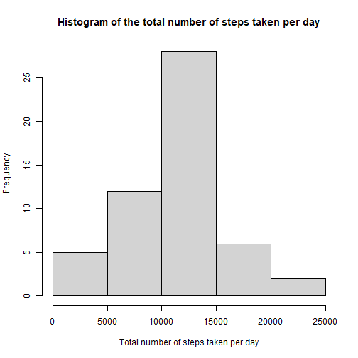
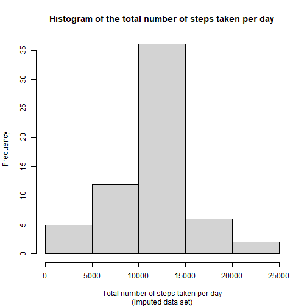
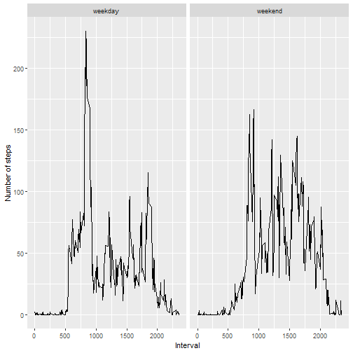

# Course Project 1

## Data loading and pre-processing

First, we load the data.


``` r
activity <- read.csv("activity.csv")
```

Let's check the structure of the data.


``` r
str(activity)
```

```
## 'data.frame':	17568 obs. of  3 variables:
##  $ steps   : int  NA NA NA NA NA NA NA NA NA NA ...
##  $ date    : chr  "2012-10-01" "2012-10-01" "2012-10-01" "2012-10-01" ...
##  $ interval: int  0 5 10 15 20 25 30 35 40 45 ...
```

Since the dates are formatted as characters,
we will convert the variable date into a Date object.


``` r
activity$date <- as.Date(activity$date)
```

Let's now check the structure of the data again.


``` r
str(activity)
```

```
## 'data.frame':	17568 obs. of  3 variables:
##  $ steps   : int  NA NA NA NA NA NA NA NA NA NA ...
##  $ date    : Date, format: "2012-10-01" "2012-10-01" ...
##  $ interval: int  0 5 10 15 20 25 30 35 40 45 ...
```

As we can see the date variable is now nicely formatted as a Date object.  
<br>
Let's summarize the data.


``` r
summary(activity)
```

```
##      steps             date               interval     
##  Min.   :  0.00   Min.   :2012-10-01   Min.   :   0.0  
##  1st Qu.:  0.00   1st Qu.:2012-10-16   1st Qu.: 588.8  
##  Median :  0.00   Median :2012-10-31   Median :1177.5  
##  Mean   : 37.38   Mean   :2012-10-31   Mean   :1177.5  
##  3rd Qu.: 12.00   3rd Qu.:2012-11-15   3rd Qu.:1766.2  
##  Max.   :806.00   Max.   :2012-11-30   Max.   :2355.0  
##  NA's   :2304
```

We can see that only the steps variable has missing data.  
<br>
As a last step, let's check the proportion of missing data in the variable steps.


``` r
mean(is.na(activity$steps))
```

```
## [1] 0.1311475
```

In conclusion, roughly 13% of the data in the variable steps is missing. 

## Part 1

For the purpose of this assignment I will turn off scientific notation for any numeric output.

``` r
options(scipen = 999)
```

Let's calculate the total number of steps taken per day with the tapply function and create a histogram of the result. Next to that I will calculate the mean and median of the total number of steps taken per day.

``` r
total_sums <- tapply(activity$steps, activity$date, sum)
hist(total_sums,
     main = "Histogram of the total number of steps taken per day",
     xlab = "Total number of steps taken per day")
mean_total_sums <- round(mean(total_sums, na.rm = TRUE), digits = 2)
median_total_sums <- median(total_sums, na.rm = TRUE)
abline(v = mean_total_sums)
```



The mean and median of the total number of steps taken per day are 10766.19 and 10765, respectively. Both of these numbers roughly correspond to the vertical line plotted in the histogram.

## Part 2

Using the function tapply once more it is fairly easy to calculate the average number of steps taken, averaged across all days (see y-axis in the plot below). The indicators for the 5-minute intervals are given on the x-axis. Note that in the code the maximum average number of steps is found by finding the index and then by plugging the index in the vector `avg_daily_steps`. This is because `avg_daily_steps` has named rows as attributes, which indicate the 5-minute intervals. In this way it is easy to find the 5-minute interval that corresponds with the maximum average number of steps.


``` r
avg_daily_steps <- tapply(activity$steps, activity$interval, mean, na.rm = TRUE)
max_avg_index <- which.max(avg_daily_steps)
max_avg <- avg_daily_steps[max_avg_index]
with(activity, plot(unique(interval), avg_daily_steps, type = "l",
                    xlab = "5-minute Interval",
                    ylab = "Number of steps"))
with(activity, abline(v = as.numeric(names(max_avg)), col = "blue"))
```


The 5-minute interval, on average across all the days in the data set, that contains the maximum number of steps is the 5-minute interval that is indicated by 835 and is depicted by the blue vertical line in the time series plot.

## Part 3

Note that the proportion of missing values was already calculated in the 'Data loading and pre-processing' Section. Here, there is specifically asked for the number of NA's, which can be calculated in the following way


``` r
sum(is.na(activity$steps))
```

```
## [1] 2304
```

It makes most sense for me to impute the missing data with the mean of each 5-minute interval, since there is a clear pattern that can be seen in the figure above. In the beginning and towards the end of the figure (presumably corresponding to the morning and evening) the least average amount of steps are taken and most average number of steps are taken in the middle (afternoon), which makes a lot of sense. The median is in general more robust to outliers, but since a lot of values in `activity$steps` are 0, the median of this vector is 0 and therefore the median number of steps taken across all days will also tend to be 0, which is not very useful. In conclusion, I will impute missing values with the mean number of steps taken averaged across all days (corresponding to the y-axis in the figure displayed above). In the code I make a copy of the data, I calculate again the mean number of steps taken, averaged across all days. Then I repeat this vector 61 times, since there are 61 days in the data set (`length(unique(activity$date))`). Lastly, I impute the missing values by means of a for loop for each of the 61 days in the data set.


``` r
activity2 <- activity

avg_daily_steps2 <- tapply(activity2$steps, activity2$interval, mean, na.rm = TRUE)

avg_daily_steps2_rep <- rep(as.numeric(avg_daily_steps2), 61)

for(i in which(is.na(activity2$steps))){
        activity2$steps[i] <- avg_daily_steps2_rep[i]
}
```

Now let's check if there are still NA's in the data.


``` r
sum(is.na(activity2$steps))
```

```
## [1] 0
```
And let's create the same histogram that we have created in Part 1, but now with the imputed data set.


``` r
total_sums2 <- tapply(activity2$steps, activity2$date, sum)
hist(total_sums2,
     main = "Histogram of the total number of steps taken per day",
     sub = "(imputed data set)",
     xlab = "Total number of steps taken per day")
mean_total_sums2 <- round(mean(total_sums2), digits = 2)
median_total_sums2 <- round(median(total_sums2), digits = 2)
abline(v = mean_total_sums2)
```


  
The mean and median of the total number of steps taken per day are 10766.19 and 10766.19, respectively. Both of these numbers correspond to the vertical line plotted in the histogram. In contrast with the mean and median calculated in Part 1, the mean and median of the total number of steps taken per day in the imputed data set are equal to each other. So basically, the median has converged to the mean.

## Part 4
For the purpose of this course project I turn off any warnings or messages that
are given for example when I call `library(dplyr)` or the `summarize()` function.

``` r
knitr::opts_chunk$set(warning = FALSE, message = FALSE) 
```

For the last part of this course project I used a for loop in combination with an if-else statement to loop through the dates and assign either "weekday" or "weekend" to the rows of a new variable that I call "weekday_or_weekend" with the help of the function `weekdays()`. Then I transform the class of this variable to a factor.


``` r
library(ggplot2)
library(dplyr)
for(i in 1:length(activity2$date)){
        if(weekdays(activity2$date[i]) %in% c("Monday", "Tuesday", "Wednesday", "Thursday", "Friday")){
                activity2$weekday_or_weekend[i] <- "weekday"
        } else {
                activity2$weekday_or_weekend[i] <- "weekend"
        }
}

activity2$weekday_or_weekend <- as.factor(activity2$weekday_or_weekend)
```
As can be seen in the output below I have succesfully created a new factor variable with two levels "weekday" and "weekend".


``` r
str(activity2)
```

```
## 'data.frame':	17568 obs. of  4 variables:
##  $ steps             : num  1.717 0.3396 0.1321 0.1509 0.0755 ...
##  $ date              : Date, format: "2012-10-01" "2012-10-01" ...
##  $ interval          : int  0 5 10 15 20 25 30 35 40 45 ...
##  $ weekday_or_weekend: Factor w/ 2 levels "weekday","weekend": 1 1 1 1 1 1 1 1 1 1 ...
```
In order to create the panel plot I use the dplyr package to group the data set by the `interval` and `weekday_or_weekend` variables. Then I summarize the groups by taking the mean of the `step` variable to obtain a data frame with the average number of steps, averaged across all weekdays and weekend days. Lastly, I use the ggplot2 package to create a simple panel plot to show the time series for both weekdays and weekend days.


``` r
activity2 %>% 
        group_by(interval, weekday_or_weekend) %>% 
        summarize(avg_steps = mean(steps)) %>%
        ggplot(aes(interval,avg_steps)) + geom_line() + facet_grid(.~weekday_or_weekend) +
        labs(x = "Interval", y = "Number of steps")
```


